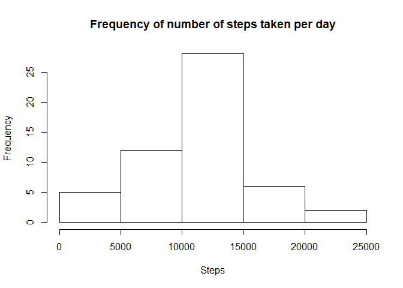
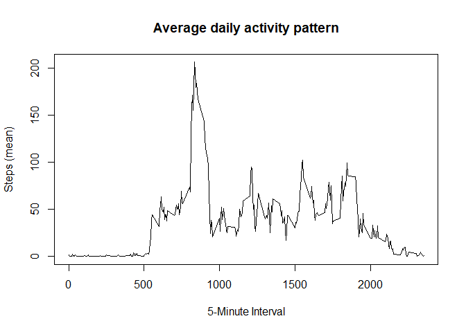
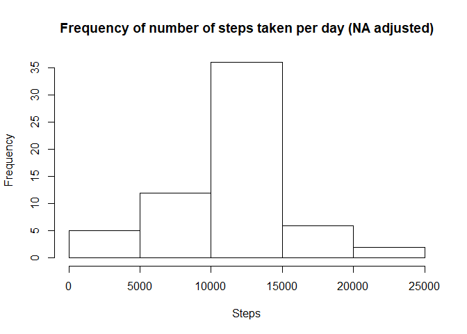
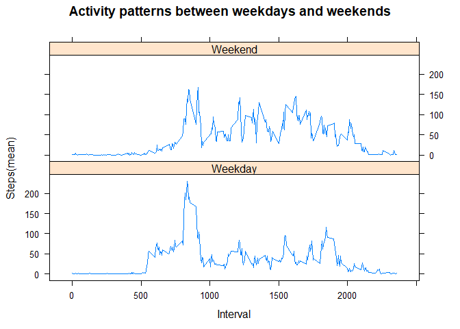

## Loading and preprocessing the data


```r
library(dplyr)
```

```
## 
## Attaching package: 'dplyr'
```

```
## The following objects are masked from 'package:stats':
## 
##     filter, lag
```

```
## The following objects are masked from 'package:base':
## 
##     intersect, setdiff, setequal, union
```

```r
# decompress zip file
unzip("activity.zip")
# read csv file
act_data <- read.csv("activity.csv", header = TRUE, sep = ",", na.strings = "NA")
# convert date character column to date
act_data$date <- as.Date.character(act_data$date,"%Y-%m-%d")
```


## What is mean total number of steps taken per day?

```r
# aggregate steps by day
act_data_tot_day <- act_data %>% group_by(date) %>% summarize(steps=sum(steps))
# plot the histogram
hist(act_data_tot_day$steps, xlab = "Steps", main = "Frequency of number of steps taken per day")
```

<!-- -->

```r
# calculate mean
mean(act_data_tot_day$steps, na.rm = TRUE)
```

```
## [1] 10766.19
```

```r
# calculate median
median(act_data_tot_day$steps, na.rm = TRUE)
```

```
## [1] 10765
```


## What is the average daily activity pattern?

```r
# calculate step mean for each interval
act_data_int <- act_data %>% group_by(interval) %>% summarize(steps=mean(steps, na.rm = TRUE))
# plot the time-series chart showing 5-minute interval and mean of steps.
plot(act_data_int$interval, act_data_int$steps, type = "l", xlab= "5-Minute Interval", ylab = "Steps (mean)", main = "Average daily activity pattern")
```

<!-- -->

```r
# return the interval with maximum number of steps
act_data_int[max(act_data_int$steps) == act_data_int$steps,]$interval
```

```
## [1] 835
```


## Imputing missing values

```r
# return the NA quantity in step variable
sum(is.na(act_data$steps))
```

```
## [1] 2304
```

```r
# for the NA values for Steps use the steps mean for the inverval (already calculated in act_data_int)
# join act_data and act_data_int
act_data_adj <- merge(act_data, act_data_int, by.x = "interval", by.y = "interval")
# find the indexese where steps is NA
indexNA <- is.na(act_data_adj$steps.x)
# updte the NA steps to the step mean in the interval
act_data_adj$steps.x[indexNA] <- act_data_adj$steps.y[indexNA]
act_data_adj$steps <- act_data_adj$steps.x
act_data_adj$steps.x <- NULL
act_data_adj$steps.y <- NULL
# aggregate steps by day
act_data_adj_day <- act_data_adj %>% group_by(date) %>% summarize(steps=sum(steps))
# plot the histogram
hist(act_data_adj_day$steps, xlab = "Steps", main = "Frequency of number of steps taken per day (NA adjusted)")
```

<!-- -->

```r
# calculate mean
mean(act_data_adj_day$steps, na.rm = TRUE)
```

```
## [1] 10766.19
```

```r
# calculate median
median(act_data_adj_day$steps, na.rm = TRUE)
```

```
## [1] 10766.19
```


## Are there differences in activity patterns between weekdays and weekends?

```r
# set locale to US
Sys.setlocale(category = "LC_TIME", locale = "US")
```

```
## [1] "English_United States.1252"
```

```r
# define Weekday or Weekend for each record
act_data_adj$day_type <- as.factor(ifelse(weekdays(act_data_adj$date, abbreviate = TRUE) %in% c("Sat","Sun"),"Weekend", "Weekday"))

# calculate step mean for each interval/day type
act_data_int_dt <- act_data_adj %>% group_by(interval, day_type) %>% summarize(steps=mean(steps, na.rm = TRUE))
# plot the time-series chart showing 5-minute interval and mean of steps per day type
library(lattice)
xyplot(steps ~ interval | day_type, data = act_data_int_dt, layout = c(1, 2), type = "l", xlab = "Interval", ylab = "Steps(mean)", main = "Activity patterns between weekdays and weekends")
```

<!-- -->

